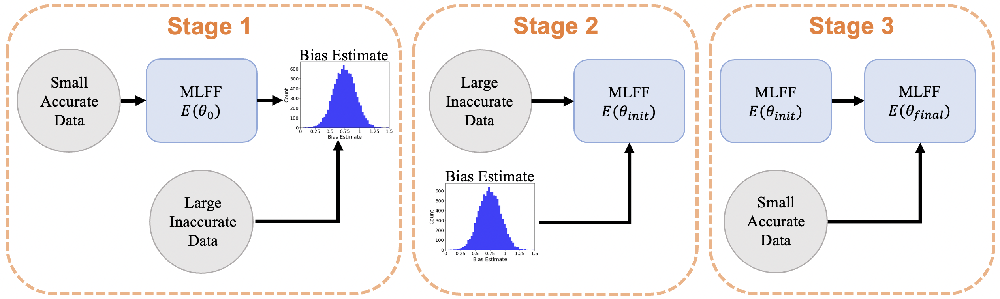

# ASTEROID: Machine Learning Force Fields with Data Cost Aware Training

Reference implementation of Machine Learning Force Fields with Data Cost Aware Training, accepted to ICML 2023. This codebase is based on [GemNet](https://github.com/TUM-DAML/gemnet_pytorch/tree/master). 



## Preparing the data
Make a directory called raw_data and download [RMD17](https://figshare.com/articles/dataset/Revised_MD17_dataset_rMD17_/12672038) as well as the relevant CCSD(T) data from [SGDML](http://sgdml.org)<br>

To process the data, we provide some helper function in `process.py` <br>
`python process.py`

We also provide data we generate through MD simulation using empirical force field methods. These datasets (containing data for each of the MD17 molecules) can be downloaded from [here](https://drive.google.com/drive/folders/10l_QEoEb3WdcNGsegTzTwxxitJ-p_RLv?usp=share_link).

## Pre-training
To pre-train GNN's with ASTEROID, we use three steps:
- Training on accurate data
- Bias estimation
- Bias-aware training


These three steps can be done with the following command.

`mkdir model_dir`

`bash scripts/aspirin_pretrain.sh`

The model_path argument needs to be changed depending on which checkpoint you use. Notice that the model_name in get_predictions.py and the load_name in pretrain_asteroid.py should correspond to one another.

## Fine-tuning
For fine-tuning with randomly inititalized model do <br>
`bash scripts/aspirin_base_200.sh` 

To finetune GNN's pre-trained with ASTEROID, do <br>
`bash scripts/aspirin_finetune.sh`

## Cite
Please cite our paper and GemNet if you use the model or this code in your own work:

```
@inproceedings{gasteiger_gemnet_2021,
  title = {GemNet: Universal Directional Graph Neural Networks for Molecules},
  author = {Gasteiger, Johannes and Becker, Florian and G{\"u}nnemann, Stephan},
  booktitle={Conference on Neural Information Processing Systems (NeurIPS)},
  year = {2021}
}
```


